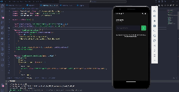

# imhere

Descrição breve do projeto.

## Pré-requisitos

- Node.js
- React Native

## Demonstração

## Contribuição

1. Fork este repositório.
2. Crie um branch com uma nova feature (`git checkout -b feature/nova-feature`).
3. Commit suas mudanças (`git commit -am 'Adicionando nova feature'`).
4. Push para o branch (`git push origin feature/nova-feature`).
5. Crie um novo Pull Request.

## Licença

[MIT](LICENSE)
